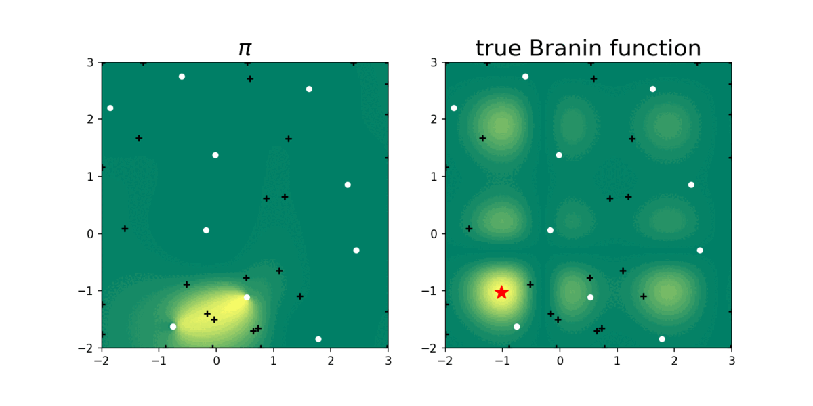

# SOBER

This repository contains the python code that was presented for the following paper.

[1] Adachi, M., Hayakawa, S., Hamid, S., Jørgensen, M., Oberhauser, H., and Osborne, M. A. SOBER: Highly Parallel Bayesian Optimization and Bayesian Quadrature over Discrete and Mixed Spaces. arXiv 2023 <br>
[arXiv](https://arxiv.org/abs/2301.11832),



- Red star: ground truth
- black crosses: next batch queries recommended by SOBER
- white dots: historical observations
- Branin function: blackbox function to maximise
- $\pi$: the probability of global optimum locations estimated by SOBER

## Features
- fast batch Bayesian optimization
- fast batch Bayesian quadrature
- fast Bayesian inference
- fast fully Bayesian Gaussian process modelling and related acquisition functions
- sample-efficient simulation-based inference
- GPU acceleration
- Arbitrary domain space (continuous, discrete, mixture, or domain space as dataset)
- Arbitrary kernel for surrogate modelling
- Arbitrary acquisition function
- Arbitrary prior distribution for Bayesian inference

## Tutorials for practitioners/researchers
We prepared the detailed explanations about how to customize SOBER for your tasks. <br>
See `tutorials`.
- 01 How does SOBER work?
- 02 Customise prior for various domain type
- 03 Customise acquisition function
- 04 Fast fully Bayesian Gaussian process modelling
- 05 Fast Bayesian inference for simulation-based inference
- 06 Deep learning based sampler for drug discovery

## Examples
See `examples` for reproducing the results in the paper.

## Brief explanation
<br>

We solve batch global optimization as Bayesian quadrature;
<br>
We select the batch query locations to minimize the integration error of the true function $f_\text{true}$ over the probability measure $\pi$.
$\pi$ is the probability of global optimum locations estimated by SOBER, and becomes confident (shrink toward true global optima) over iterations.

## Requirements
- PyTorch
- GPyTorch
- BoTorch

## Cite as
Please cite this work as
```
@article{adachi2023sober,
  title={SOBER: Highly Parallel Bayesian Optimization and Bayesian Quadrature over Discrete and Mixed Spaces},
  author={Adachi, Masaki and Hayakawa, Satoshi and Hamid, Saad and Jørgensen, Martin and Oberhauser, Harald and Osborne, Michael A.},
  journal={arXiv preprint arXiv:2301.11832},
  year={2023}
}
```
