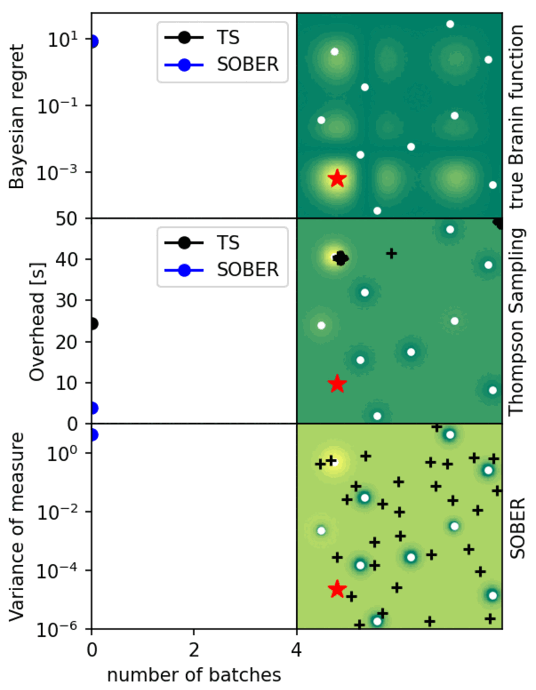

# SOBER

Fast Bayesian optimization, quadrature, inference over arbitrary domain (discrete and mixed spaces) with GPU parallel acceleration based on GPytorch and BoTorch.
The paper is here [arXiv](https://arxiv.org/abs/2301.11832),



While the existing method (batch Thompson sampling; TS) is stuck in the local minima, SOBER robustly finds global optimmum.<br>
SOBER provides a faster, more sample-efficient, more diversified, and more scalable optimization scheme than existing methods.<br>
In the paper, SOBER outperformed 11 competitive baselines on 12 synthetic and diverse real-world tasks.
- Red star: ground truth
- black crosses: next batch queries recommended by SOBER
- white dots: historical observations
- Branin function: blackbox function to maximise
- $\pi$: the probability of global optimum locations estimated by SOBER

## Features
- fast batch Bayesian optimization
- fast batch Bayesian quadrature
- fast Bayesian inference
- fast fully Bayesian Gaussian process modelling and related acquisition functions
- sample-efficient simulation-based inference
- Massively parallel active learning
- GPU acceleration
- Arbitrary domain space (continuous, discrete, mixture, or domain space as dataset)
- Arbitrary kernel for surrogate modelling
- Arbitrary acquisition function
- Arbitrary prior distribution for Bayesian inference

## Tutorials for practitioners/researchers
We prepared detailed explanations about how to customize SOBER for your tasks. <br>
See `tutorials`.
- 00 Quick start
- 01 How does SOBER work?
- 02 Customise prior for various domain types
- 03 Customise acquisition function
- 04 Fast fully Bayesian Gaussian process modelling
- 05 Fast Bayesian inference for simulation-based inference
- 06 Tips for drug discovery
- 07 Compare with Thompson sampling
- 08 Benchmarking against batch BO methods.ipynb

## Examples
See `examples` for reproducing the results in the paper.

## Brief explanation
<br>

We solve batch global optimization as Bayesian quadrature;
<br>
We select the batch query locations to minimize the integration error of the true function $f_\text{true}$ over the probability measure $\pi$.
$\pi$ is the probability of global optimum locations estimated by SOBER and becomes confident (shrink toward true global optima) over iterations.

## Requirements
- PyTorch
- GPyTorch
- BoTorch

## Acknowledgement
This code repository uses materials from the following public and provided codes. The authors thank the respective repository maintainers

- BASQ: Adachi, M., Hayakawa, S., Jørgensen, M., Oberhauser, H., Osborne, M. A., Fast Bayesian Inference with Batch Bayesian Quadrature via Kernel Recombination. Advances in Neural Information Processing Systems, 35 (NeurIPS 2022) [code](https://github.com/ma921/BASQ), [paper](https://proceedings.neurips.cc/paper_files/paper/2022/hash/697200c9d1710c2799720b660abd11bb-Abstract-Conference.html)
- RCHQ: Hayakawa, S., Oberhauser, H., Lyons, T., Positively Weighted Kernel Quadrature via Subsampling. Advances in Neural Information Processing Systems, 35 (NeurIPS 2022) [code](https://github.com/satoshi-hayakawa/kernel-quadrature), [paper](https://arxiv.org/abs/2107.09597v4)
- Thompson sampling: Kandasamy, K., Krishnamurthy, A., Schneider, J. and Póczos, B., 
Parallelised Bayesian optimisation via Thompson sampling. International Conference on Artificial Intelligence and Statistics (AISTATS 2018) [code from BoTorch](https://botorch.org/tutorials/thompson_sampling), [paper](https://proceedings.mlr.press/v84/kandasamy18a.html)
- Decoupled Thompson sampling: Wilson, J., Borovitskiy, V., Terenin, A., Mostowsky, P. and Deisenroth, M., Efficiently sampling functions from Gaussian process posteriors. International Conference on Machine Learning (ICML 2020) [code from @saitcakmak](https://github.com/saitcakmak/gp-sampling), [paper](https://arxiv.org/abs/2002.09309)
- Determinantal Point Process (DPP) - Thompson sampling: Nava, E., Mutny, M. and Krause, A., Diversified sampling for batched bayesian optimization with determinantal point processes. International Conference on Artificial Intelligence and Statistics (AISTATS 2022)
(the code is provided by the paper author [@elvisnava](https://github.com/elvisnava/)), [paper](https://arxiv.org/abs/2110.11665)
- GIBBON [code from BoTorch](https://botorch.org/tutorials/GIBBON_for_efficient_batch_entropy_search). [paper](https://arxiv.org/abs/2102.03324)
- Hallucination [paper](https://papers.nips.cc/paper_files/paper/2010/hash/e702e51da2c0f5be4dd354bb3e295d37-Abstract.html)
- local penalisation [paper](https://proceedings.mlr.press/v51/gonzalez16a.html)
- TuRBO: Eriksson, D., Pearce, M., Gardner, J. R., Turner, R., & Poloczek, M. (2019). Scalable global optimization via local Bayesian optimization. Advances in Neural Information Processing Systems, 32 (NeurIPS 2019) [code from BoTorch](https://botorch.org/tutorials/turbo_1), [paper](https://arxiv.org/abs/1910.01739)

## Cite as
Please cite this work as
```
@article{adachi2023sober,
  title={SOBER: Highly Parallel Bayesian Optimization and Bayesian Quadrature over Discrete and Mixed Spaces},
  author={Adachi, Masaki and Hayakawa, Satoshi and Hamid, Saad and Jørgensen, Martin and Oberhauser, Harald and Osborne, Michael A.},
  journal={arXiv preprint arXiv:2301.11832},
  year={2023}
}
```
